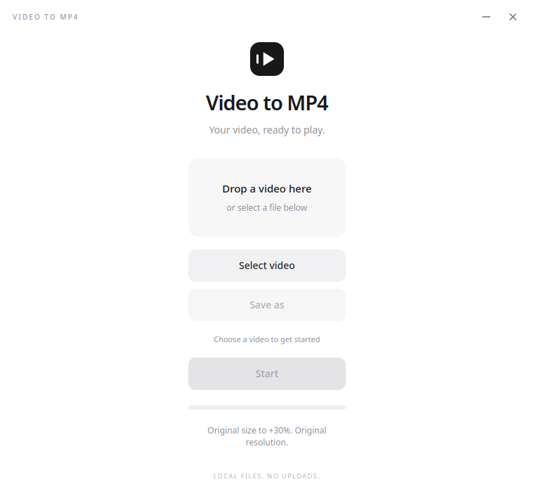
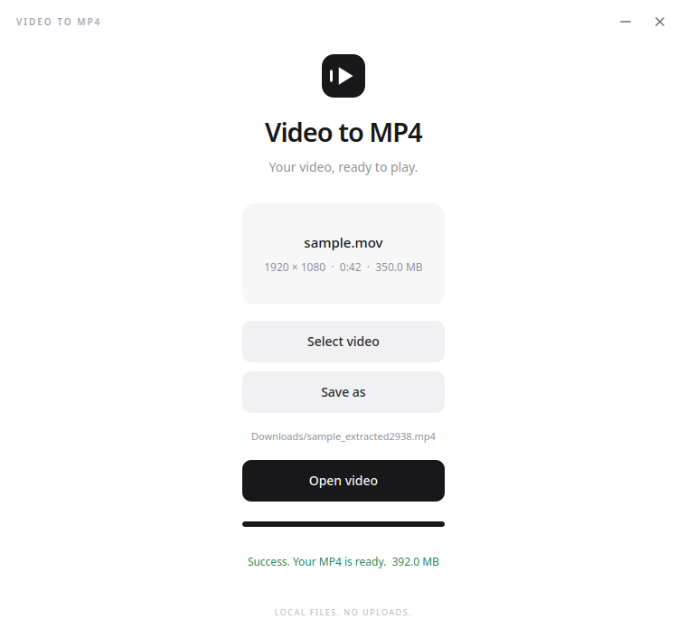

<p align="center">
  
</p>
<h1 align="center">Video to MP4</h1>
<p align="center">A minimal desktop converter. Local files. No uploads.</p>
<p align="center"><strong>v1.0 · by jotadev27 · MIT</strong></p>
<p align="center">
  
</p>

### Use

1. Drop one video into the window, or click **Select video**.
2. Click **Start**. The MP4 is saved beside the original as `video_extracted2938.mp4`; the four digits are random.
3. Use **Save as** for another location. Use **Cancel** to stop or **Open video** after completion.

Originals and existing files are never overwritten. Output uses H.264 video and
AAC audio for broad playback compatibility. Formats must be readable by FFmpeg;
damaged, protected, or unsupported files show an error.

### Install v1.0

Download the matching file from [Releases](https://github.com/jotadev27/VideoToMP4/releases/tag/v1.0).
Packages include Python, Qt, and FFmpeg. All packages are **64-bit x86**.

**Ubuntu 22.04 or later** — paste into a terminal in the downloaded file's folder:

```bash
sudo apt install ./VideoToMP4-v1.0-linux-ubuntu-amd64.deb
videotomp4
```

**Fedora 40 or later:**

```bash
sudo dnf install ./VideoToMP4-v1.0-linux-fedora-x86_64.rpm
videotomp4
```

**Windows 10/11:** open `VideoToMP4-v1.0-windows-setup.exe`, then follow
**Next → license → location → Install → Finish**. The English installer includes
custom artwork, a Start menu shortcut, and an uninstaller. Installation is per
user and does not require administrator access. The binary is unsigned.

**Windows portable:** extract `VideoToMP4-v1.0-windows-portable.zip` and open
`VideoToMP4.exe`. Keep the entire extracted folder together.

### Size and quality

The completed file is **100–130% of the original file size**. Compatible video
is copied without re-encoding when it fits; other codecs use a two-pass bitrate
budget. Results above the limit are retried or rejected before saving.
Smaller results receive a standard MP4 `free` box to meet the requested minimum;
this padding adds no quality. File size is not a quality measurement, and
re-encoding cannot guarantee mathematically lossless output for every codec.

Resolution is kept. Odd dimensions need at most one added edge pixel for H.264.
HDR is tone-mapped to SDR for broader playback. The first video and audio tracks
are used; subtitles and additional tracks are not included.

<p align="center">
  
</p>

### Run from source

Python 3.10+ is required. Ubuntu: `sudo apt install python3 python3-venv`.
Fedora: `sudo dnf install python3 python3-pip`. Then:

```bash
git clone https://github.com/jotadev27/VideoToMP4.git
cd VideoToMP4
bash run.sh
```

On Windows with Python installed:

```powershell
py -m venv .venv
.venv\Scripts\python -m pip install -r requirements.txt
.venv\Scripts\python main.py
```

### Verify and develop

```bash
sha256sum -c SHA256SUMS.txt
.venv/bin/python -m unittest discover -s tests -v
```

On Windows, compare `(Get-FileHash .\VideoToMP4-v1.0-windows-setup.exe -Algorithm SHA256).Hash`
with `SHA256SUMS.txt`. Build recipes, release text, and checksums live in
[`installer/`](installer/README.md); binaries are excluded from Git and attached
to Releases instead. See [security](SECURITY.md) and [dependency licenses](THIRD_PARTY_NOTICES.md).
